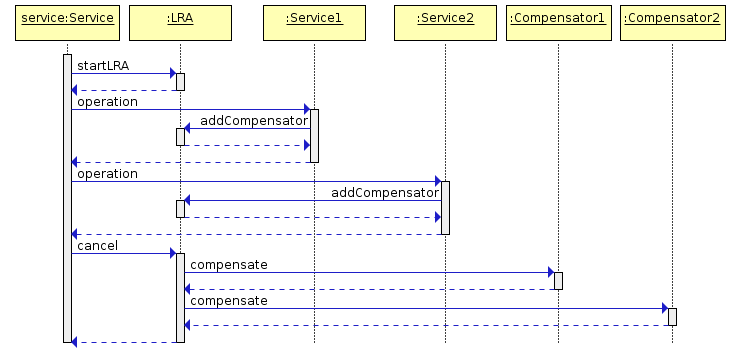

= Camel Saga: demo application

Демо приложение по реализации Saga EIP средствами Apache Camel.

 Service: start Saga, calls Service1, Service2
 Service1: join Saga
 Service2: join Saga, implements demo logic: ok, fault, timeout.

Предполагается что cancel Saga будет происходить:

1. Когда Service2 вернет HTTP 500 (параметр fault)
2. Когда Service2 будет выполняться дольше заданного timeout (параметр timout)

== Usage

1. Запустить lra-coordinator. Из директории docker/lra-coordinator:
[source,bash]
 lra-coordinator $ docker-compose up -d

2. Запустить сервисы service, service1, service2.

3. ok flow: +
В логах не будет записей о compensate actions.
[source,bash]
curl -v -d "{'business_id':'1234'}" -H "Content-Type: application/json" localhost:8888/api/ok

4. fault flow +
В логах сервисов service1, service2 будут записи о выполнении compensate actions.
[source,bash]
curl -v -d "{'business_id':'1234'}" -H "Content-Type: application/json" localhost:8888/api/fault

5. timeout flow +
[source,bash]
curl -v -d "{'business_id':'1234'}" -H "Content-Type: application/json" localhost:8888/api/timeout

Должны быть compensate в service1, service2.

Но у меня:

* Service: NPE в Undertow
* Service1: сначала compensate, потом completion
* Service2: только бизнес-логика, т.к. не задан timeout в параметрах saga и не задан completion

=== lra-service
реализует логику взаимодействия с Coordinator.
Сервис слушает ${camel.service.local-participant-url}/lra-participant/compensate и передает управление в endpoint указанный в параметре Camel-Saga-Compensate.
Также перадает в данный endpoint остальные параметры, которые определяют бизнес-данные.
Параметры и Camel-Saga-Compensate в свою очередь определяются в route, компоненте saga().
